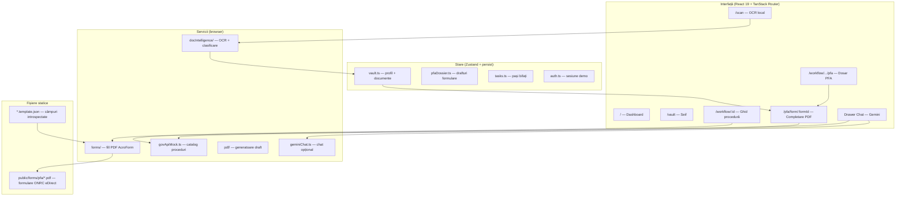
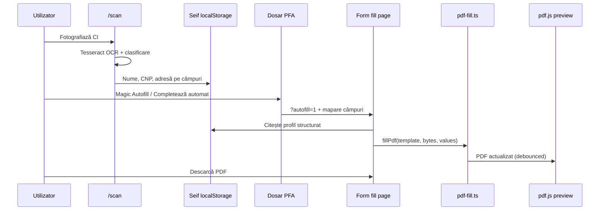

# ActeAI — Agent civic pentru birocrația din România

**ActeAI** este o aplicație web care ajută cetățenii să parcurgă proceduri la stat (ONRC, ANAF, DRPCIV, primărie etc.): înțeleg ce documente îți trebuie, unde le depui, și — pentru PFA — completezi formularele oficiale ONRC **în aplicație**, din datele tale, fără să sari între 5 site-uri.

Proiect realizat pentru **Bosch Hackathon** (sinteză din mai multe prototipuri anterioare).

---

## Pitch în 30 de secunde

> „Românii pierd ore pe formulare ONRC cu câmpuri `Text1`, `Text2`… și pe site-uri diferite. ActeAI ține datele tale **doar pe telefon** (seif local), scanează buletinul o dată, apoi **completează automat PDF-urile oficiale** cu previzualizare live. Ghidurile pas-cu-pas și chat-ul AI te duc la ghișeu sau pe portal cu tot dosarul pregătit.”

---

## Demo recomandat (5–7 minute)

Ordinea care impresionează juriul — fiecare pas are un „de ce” tehnic de menționat:

| # | Ce arăți | Ce spui | Fișier / rută cheie |
|---|----------|---------|---------------------|
| 1 | **Login demo** + dashboard | „Zero backend obligatoriu — MVP rulează în browser.” | `test@gmail.com` + orice parolă/OTP |
| 2 | **Setări accesibilitate** | „Mod senior, contrast ridicat, font dislexie — WCAG nu e afterthought.” | `/settings` → `AccessibilityMenu` |
| 3 | **Scanare CI** | „OCR local cu Tesseract — **niciun byte** nu pleacă la server.” | `/scan` → `docIntelligence/` |
| 4 | **Seif** | „Adresa e structurată: stradă, nr, bloc — nu un blob.” | `/vault` → `store/vault.ts` |
| 5 | **Ghid PFA** | „Catalog de proceduri verificate, pași cu instituție, taxe, hartă.” | `/workflow/pfa-registration` |
| 6 | **Dosar PFA** | „7 documente într-un singur loc; autofill din seif.” | `/workflow/pfa-registration/pfa` |
| 7 | **Formular split** | „Stânga: câmpuri în română. Dreapta: PDF ONRC actualizat live.” | `.../pfa/form/rezervare-denumire-24940` |
| 8 | **Descarcă PDF** | „PDF completat, gata de depus la ONRC.” | `pdf-fill.ts` |
| 9 | **Chat** (opțional) | „Întrebări libere → deschide workflow-ul potrivit.” | FAB chat → `geminiChat.ts` |

**URL-uri rapide după `npm run dev`:**

```
http://localhost:8080/
http://localhost:8080/vault
http://localhost:8080/scan
http://localhost:8080/workflow/pfa-registration
http://localhost:8080/workflow/pfa-registration/pfa
http://localhost:8080/workflow/pfa-registration/pfa/form/rezervare-denumire-24940?autofill=1
```

---

## Cele 3 piloni (de ce există proiectul)

### 1. Accesibilitate extremă

- **Mod senior** — text mai mare, ținte tactile mai mari (`styles.css`, `store/settings.ts`).
- **Contrast ridicat**, font **Atkinson Hyperlegible** pentru dislexie.
- **Citește cu voce** + respectă `prefers-reduced-motion`.
- **Mobile-first** — cetățenii folosesc telefonul la ghișeu.

### 2. Local-first (Seif / Vault)

- Profil + documente în **`localStorage`** (`civis-vault`).
- CNP, adresă structurată, date CI — **nu trimit actele la un server ActeAI**.
- Chat-ul Gemini primește doar un **profil redus** (prenume, localitate, CNP mascat) — vezi `services/geminiChat.ts`.

### 3. Inteligență hibridă

| Nevoie | Soluție | De ce așa |
|--------|---------|-----------|
| Proceduri cunoscute (PFA, permis, ANAF…) | Catalog static instant | `services/govApiMock.ts` — fără latență, fără halucinații |
| Întrebări rare / formulări | Gemini + function calling | `services/geminiChat.ts` — deschide workflow-ul corect |
| Cod CAEN pentru PFA | RAG / sugestie activitate | `services/rag.ts` |
| Validare CNP din CI | Reguli + cifră control | `docIntelligence/fieldExtractor.ts` |

---

## Arhitectură — cum stau piesele



**De ce fără backend propriu?** Pentru hackathon: demonstrăm că **confidențialitatea** și **viteza** sunt posibile când logica grea rulează în browser. Producție: cheia Gemini și EidKit ar trebui mutate pe un proxy server.

---

## Fluxul vedetă: Seif → Autofill → PDF ONRC

Asta e diferențiatorul față de „doar un chatbot” sau față de Tipizatul (care e excelent, dar alt produs).



### Unde e codul (PFA)

| Pas | Fișier | Rol |
|-----|--------|-----|
| PDF-uri oficiale ONRC | `public/forms/pfa/*.pdf` | Sursă eDirect, versionate în repo |
| Listă câmpuri PDF | `scripts/introspect-pfa-form.mjs` | Generează `*.template.json` din AcroForm |
| Etichete românești | `src/data/forms/pfa/field-labels.ro.ts` | `Text1` → „Nume solicitant” etc. |
| Mapare seif → câmp PDF | `src/data/forms/pfa/pfa-field-sources.ts` | **1:1** pe poziție în PDF (nu ghicire) |
| Motor completare | `src/services/forms/pdf-fill.ts` | pdf-lib + fonturi românești |
| Previzualizare | `src/components/pfa/pdf-preview.tsx` | pdf.js, fără flicker (fingerprint bytes) |
| UI split | `src/routes/workflow.$id.pfa.form.$formId.tsx` | Stânga câmpuri, dreapta PDF |
| Registru dosar | `src/services/forms/pfaRegistry.ts` | 7 carduri document (rezervare, declarație, CI…) |

**De ce mapare explicită (`pfa-field-sources.ts`)?**  
Formularele ONRC au câmpuri interne `Text7`, `Text8`… Ordinea pe hârtie **nu** e ordinea din JSON. Am corelat pozițiile widget-urilor din PDF cu etichetele tipărite. Regulile generice („orice câmp cu *adresă*”) umpleau greșit secțiunea „Sedii secundare” sau puneau CNP la localitate.

**De ce `sedii_sec_*` și matrice CAEN secundară sunt blocate la autofill?**  
Sunt zeci de micro-câmpuri (câte o cifră). Autofill-ul le umplea pe toate cu aceeași adresă — de aici bug-ul din screenshot-uri. Acum: doar rândul CAEN principal, opțional.

---

## Dosar PFA — cele 7 „carduri”

Definite în `PFA_DOSSIER_CARDS` (`pfaRegistry.ts`):

| Card | Tip | Ce face aplicația |
|------|-----|------------------|
| Rezervare denumire | `acroform` | Formular ONRC 24940 — split + autofill |
| Cerere înregistrare | `generated_pdf` | PDF oficial fără câmpuri → **draft** ActeAI (`cererePfa.ts`) |
| Declarație proprie răspundere | `acroform` | Formular ONRC — split + autofill |
| Act identitate | `attach` | Link spre seif / scan |
| Dovadă sediu | `attach` | Idem |
| Specimen semnătură | `checklist` | Instrucțiuni notar/ONRC |
| Dovadă calificare | `attach` | Doar dacă CAEN-ul o cere |

---

## Scanare document — pipeline local

```
Fișier imagine
    → calitate imagine (blur, contrast)
    → Tesseract OCR (română)
    → clasificare tip (CI, factură, permis…)
    → extragere câmpuri (CNP validat, adresă parsată)
    → utilizator confirmă → Seif
```

Cod: `src/services/docIntelligence/` (`pipeline.ts`, `ocr.ts`, `classifier.ts`, `fieldExtractor.ts`).

**Limitare curentă:** PDF la scan e respins în pipeline (doar imagini); formularele PFA sunt PDF-uri **completate** de noi, nu scanate.

---

## Catalog proceduri (`govApiMock.ts`)

Nu e „mock” în sensul de date random — e un **catalog curat** de zeci de proceduri românești:

- Pași ordonați cu instituție, taxă estimată, timp, documente necesare.
- Acțiuni per pas: deschide URL oficial, hartă instituții, sugerează CAEN, generează PDF draft.
- Sursă și dată verificare (`DataSource`) pentru transparență.

Workflow-ul **PFA** (`pfa-registration`) e cel mai complet pentru demo.

---

## Chat AI (opțional la demo)

- Model: **Gemini 2.5 Flash** (`@google/genai`).
- **Function calling:** `open_workflow`, `search_nearby` etc. — răspunsul poate naviga direct la ghid.
- Cheie: `VITE_GEMINI_API_KEY` în `.env` (vezi `.env.example`).

Fără cheie: restul aplicației funcționează; chat-ul arată mesaj de configurare.

---

## Stack tehnic

| Layer | Tehnologii |
|-------|------------|
| Build | Vite 7, TypeScript 5.8 |
| UI | React 19, Tailwind v4, shadcn/ui, Radix |
| Routing | TanStack Router + TanStack Start (file-based `src/routes/`) |
| Stare | Zustand + persist (`localStorage`) |
| Formulare UI | react-hook-form + Zod |
| PDF | pdf-lib, pdfjs-dist, @pdf-lib/fontkit, Noto Sans |
| OCR | tesseract.js |
| AI | @google/genai (opțional) |
| Deploy | Cloudflare adapter (`@cloudflare/vite-plugin`) |

---

## Structura proiectului (unde cauți ce)

```
civic-agent-hackathon/
├── public/forms/pfa/          # PDF-uri ONRC + template.json generate
├── public/fonts/              # Noto Sans TTF (diacritice în PDF)
├── scripts/
│   └── introspect-pfa-form.mjs # Regenerare template-uri din PDF
├── src/
│   ├── routes/                # O pagină = un fișier (TanStack file routing)
│   │   ├── index.tsx          # Dashboard
│   │   ├── vault.tsx          # Seif (adresă structurată)
│   │   ├── scan.tsx           # Scanare + adopt în seif
│   │   ├── workflow.$id.tsx   # Ghid procedură generic
│   │   ├── workflow.$id.pfa.tsx           # Hub dosar PFA
│   │   └── workflow.$id.pfa.form.$formId.tsx  # Completare formular
│   ├── components/
│   │   ├── pfa/               # pdf-preview, pfa-form-field
│   │   ├── chat/              # AgentChatPanel
│   │   └── workflow/          # acțiuni pași, Tipizatul card
│   ├── store/                 # Zustand: vault, auth, tasks, pfaDossier…
│   ├── services/
│   │   ├── govApiMock.ts      # Catalog proceduri (mare, ~2000+ linii)
│   │   ├── forms/             # pdf-fill, fieldMapper, pfaRegistry
│   │   ├── docIntelligence/   # OCR pipeline
│   │   ├── geminiChat.ts      # Chat streaming
│   │   └── pdf/               # antecontract, declaratiePfa, cererePfa
│   ├── data/forms/pfa/        # Etichete RO + mapări câmpuri
│   └── lib/                   # address parser, pdf-bytes fingerprint
└── package.json
```

### Rute importante

| Rută | Componentă |
|------|------------|
| `/` | Dashboard, alerte expirare acte, quick links |
| `/login`, `/verify` | Auth demo 2FA |
| `/vault` | Editare profil |
| `/scan` | OCR document |
| `/tasks` | Proceduri începute |
| `/services` | Catalog proceduri |
| `/chat` | Istoric chat |
| `/workflow/:id` | Ghid pas-cu-pas |
| `/workflow/pfa-registration/pfa` | Dosar PFA |
| `/workflow/.../pfa/form/:formId` | Completare PDF |

---

## Stare persistentă (localStorage)

| Cheie Zustand | Conținut |
|---------------|----------|
| `civis-vault` | Profil, `addressParts`, documente scanate |
| `civis-pfa-dossier` | CAEN, denumire PFA, drafturi per formular, status carduri |
| `civis-tasks` | Proceduri active, pași bifați |
| `civis-auth` | Email sesiune demo |
| `civis-settings` | Senior mode, contrast, font |
| `civis-chat-ui` | Drawer chat deschis / sesiune |

---

## Pornire rapidă

```bash
npm install
cp .env.example .env    # opțional: VITE_GEMINI_API_KEY pentru chat
npm run dev
```

Deschide URL-ul afișat de Vite (de obicei **http://localhost:8080**).

### Cont demo

- Email: `test@gmail.com`
- Parolă: orice
- OTP: orice 6 cifre  

La primul login se încarcă profil demo (`lib/demoSeed.ts`) — util pentru pitch fără scan.

### Scripturi utile

```bash
npm run dev        # development
npm run typecheck  # TypeScript
npm run build      # production build
npm run lint       # ESLint
npm run format     # Prettier
```

### Regenerare template-uri PFA (după schimbare PDF)

```bash
node scripts/introspect-pfa-form.mjs
```

Apoi verifică `public/forms/pfa/` și `src/data/forms/pfa/`. Etichetele UI vin din `field-labels.ro.ts` + `pfa-field-sources.ts` (nu doar din JSON).

---

## Confidențialitate & mesaj pentru juriu

1. **Datele sensibile rămân pe dispozitiv** — profil, preview documente, drafturi formulare.
2. **Scanarea nu încarcă CI-ul pe serverul nostru** — Tesseract în WASM/browser.
3. **Chat-ul nu vede documentele** — doar context minimal mascat.
4. **Transparentă cu surse** — workflow-uri cu link ONRC/ANAF și dată „verificat la”.
5. **Producție:** chei API în `.env` expuse în bundle — trebuie proxy server înainte de launch public.

---

## Ce NU facem (onest pentru Q&A)

- Nu înlocuim **Revisal**, **SPV**, sau semnarea electronică calificată pe portal.onrc.ro — ghidăm și pregătim dosarul.
- Nu garantăm validarea juridică a textelor generate — utilizatorul verifică la ghișeu.
- Nu avem integrare live cu API ONRC — folosim PDF-uri eDirect + completare locală.
- Tipizatul (produs separat) rămâne referință pentru UX; noi aducem **seif + OCR + mapare pe PDF-uri reale ONRC**.

---

## Idei de extindere (roadmap slide)

- [ ] Proxy server pentru Gemini / EidKit  
- [ ] Semnătură electronică calificată (integrare sau export către portal)  
- [ ] Mai multe formulare ONRC introspectate automat  
- [ ] PWA offline pentru ghișeu  
- [ ] Validare în timp real pe reguli ANAF/ONRC  

---

## Licență / proveniență

Proiect hackathon. Componente inspirate din prototipurile `civic-agent-alexia`, `civic-agent-buian`, `civic-agent-alex` (vezi istoric commit / documentație internă).

Formulare PDF: surse **eDirect ONRC** în `public/forms/pfa/` — verifică termenii ONRC înainte de redistribuție comercială.

---

## Contact rapid pentru demo

Dacă ceva nu merge la pitch:

1. Hard refresh (`Cmd+Shift+R`) după pull.  
2. Verifică seiful (`/vault`) — nume + CNP obligatorii pentru autofill.  
3. Pentru formulare PFA: folosește **Rezervare denumire** sau **Declarație** (nu „Cerere înregistrare” pentru demo split view — acela e PDF generat fără AcroForm).  
4. Chat: pune `VITE_GEMINI_API_KEY` în `.env`.

**Întrebări despre cod?** Caută în repo: `pfa-field-sources`, `pdf-fill`, `fieldMapper`, `vault.ts` — sunt inima autofill-ului.
