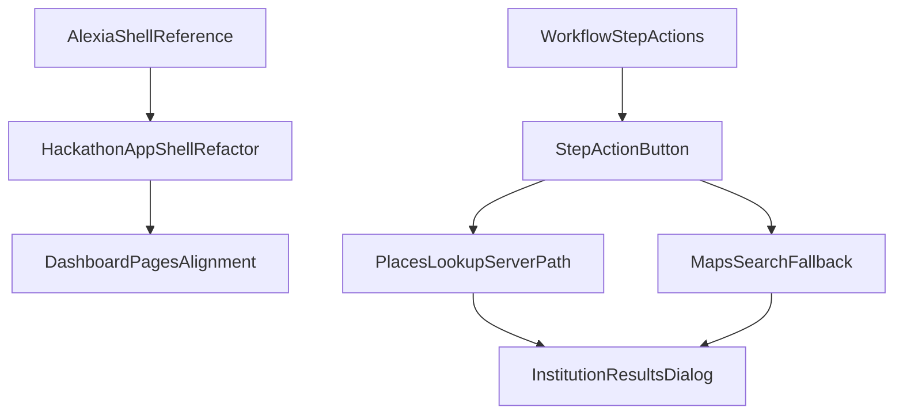

# Alexia UI/UX + Maps Restoration Plan

## Objectives
- Create a repo-level `plans` directory and keep working plans there for team visibility.
- Replace the current mobile-bottom-nav shell with full `civic-agent-alexia` shell standards (left sidebar desktop-first, alexia-like page hierarchy).
- Restore Google Maps institution lookup behavior to match `civic-agent-buian` (Places lookup path + fallback search URL path).

## Target Repositories and Canonical Sources
- **Implementation target:** [`/Users/buiandragos/Documents/faculta/Cluj-Hackathon/civic-agent-hackathon`](/Users/buiandragos/Documents/faculta/Cluj-Hackathon/civic-agent-hackathon)
- **UI shell reference (authoritative):** [`/Users/buiandragos/Documents/faculta/Cluj-Hackathon/civic-agent-alexia/apps/web/src/app/(dashboard)/layout.tsx`](/Users/buiandragos/Documents/faculta/Cluj-Hackathon/civic-agent-alexia/apps/web/src/app/(dashboard)/layout.tsx), [`/Users/buiandragos/Documents/faculta/Cluj-Hackathon/civic-agent-alexia/apps/web/src/components/dashboard/app-sidebar.tsx`](/Users/buiandragos/Documents/faculta/Cluj-Hackathon/civic-agent-alexia/apps/web/src/components/dashboard/app-sidebar.tsx), [`/Users/buiandragos/Documents/faculta/Cluj-Hackathon/civic-agent-alexia/apps/web/src/components/dashboard/page-header.tsx`](/Users/buiandragos/Documents/faculta/Cluj-Hackathon/civic-agent-alexia/apps/web/src/components/dashboard/page-header.tsx)
- **Maps behavior reference (authoritative):** [`/Users/buiandragos/Documents/faculta/Cluj-Hackathon/civic-agent-buian/Civic Guide AI/src/components/flow/StepActionButton.tsx`](/Users/buiandragos/Documents/faculta/Cluj-Hackathon/civic-agent-buian/Civic%20Guide%20AI/src/components/flow/StepActionButton.tsx), [`/Users/buiandragos/Documents/faculta/Cluj-Hackathon/civic-agent-buian/Civic Guide AI/src/lib/agent.functions.ts`](/Users/buiandragos/Documents/faculta/Cluj-Hackathon/civic-agent-buian/Civic%20Guide%20AI/src/lib/agent.functions.ts)

## Phase 0 — Planning Artifacts Location
- Create [`/Users/buiandragos/Documents/faculta/Cluj-Hackathon/civic-agent-hackathon/plans`](/Users/buiandragos/Documents/faculta/Cluj-Hackathon/civic-agent-hackathon/plans).
- Copy/move active plan markdown into this folder (without modifying intent/content), so execution docs live in-repo.

## Phase 1 — Full Alexia Shell Migration
- Refactor [`/Users/buiandragos/Documents/faculta/Cluj-Hackathon/civic-agent-hackathon/src/components/app-shell.tsx`](/Users/buiandragos/Documents/faculta/Cluj-Hackathon/civic-agent-hackathon/src/components/app-shell.tsx) to alexia-style structure:
  - desktop: persistent left sidebar + top user strip + main content column,
  - mobile: compact header + horizontal nav pills (not bottom tab bar).
- Introduce alexia-like sidebar component in target repo (new file, e.g. `src/components/dashboard/app-sidebar.tsx`) and align nav destinations with existing app routes.
- Add alexia-like page header component (new file, e.g. `src/components/dashboard/page-header.tsx`) and adopt on high-traffic pages.
- Preserve existing Civis-specific behaviors inside new shell:
  - global chat drawer mounting,
  - accessibility menu and class sync,
  - auth/logout behavior.

## Phase 2 — Page Composition Alignment (Alexia Standard)
- Update layout density and hierarchy in:
  - [`/Users/buiandragos/Documents/faculta/Cluj-Hackathon/civic-agent-hackathon/src/routes/index.tsx`](/Users/buiandragos/Documents/faculta/Cluj-Hackathon/civic-agent-hackathon/src/routes/index.tsx)
  - [`/Users/buiandragos/Documents/faculta/Cluj-Hackathon/civic-agent-hackathon/src/routes/vault.tsx`](/Users/buiandragos/Documents/faculta/Cluj-Hackathon/civic-agent-hackathon/src/routes/vault.tsx)
  - [`/Users/buiandragos/Documents/faculta/Cluj-Hackathon/civic-agent-hackathon/src/routes/tasks.tsx`](/Users/buiandragos/Documents/faculta/Cluj-Hackathon/civic-agent-hackathon/src/routes/tasks.tsx)
  - [`/Users/buiandragos/Documents/faculta/Cluj-Hackathon/civic-agent-hackathon/src/routes/settings.tsx`](/Users/buiandragos/Documents/faculta/Cluj-Hackathon/civic-agent-hackathon/src/routes/settings.tsx)
- Ensure visual parity with alexia standards for spacing, sidebar states, and page-level card rhythm.

## Phase 3 — Restore Buian-Style Google Maps Institution Lookup
- Replace current link-only institution logic in:
  - [`/Users/buiandragos/Documents/faculta/Cluj-Hackathon/civic-agent-hackathon/src/services/findInstitution.ts`](/Users/buiandragos/Documents/faculta/Cluj-Hackathon/civic-agent-hackathon/src/services/findInstitution.ts)
  - [`/Users/buiandragos/Documents/faculta/Cluj-Hackathon/civic-agent-hackathon/src/components/workflow/step-action-button.tsx`](/Users/buiandragos/Documents/faculta/Cluj-Hackathon/civic-agent-hackathon/src/components/workflow/step-action-button.tsx)
- Add buian-equivalent lookup behavior:
  - geolocation-based “lângă mine” flow,
  - city/profile-based flow,
  - structured results dialog (name, address, rating/open state/phone/mapsUrl).
- Implement server-assisted lookup path equivalent to buian behavior:
  - connector-backed Google Places search when keys exist,
  - deterministic fallback to Google Maps search URL when keys are missing or API fails.

## Phase 4 — Routing and Navigation Hardening
- Ensure all authenticated routes keep consistent shell behavior:
  - workflow pages and nested specialized pages stay visually consistent in sidebar context.
- Keep `/login` and `/verify` outside dashboard shell.
- Verify route tree generation and active-link behavior for nested workflow routes.

## Phase 5 — Validation and Acceptance
- Run and verify:
  - `typecheck`, `lint`, `build`
- Manual checks:
  - sidebar navigation active states on desktop/mobile,
  - chat and accessibility controls still globally reachable,
  - `find_institution` actions produce rich results when maps keys are configured,
  - fallback maps links work when keys are absent,
  - no regression in workflow/task/vault paths.

## Architecture/Data Flow

## Key Risks and Controls
- **Risk:** sidebar migration breaks mobile navigation discoverability.
  - **Control:** explicit mobile pill nav parity and route coverage check.
- **Risk:** maps connector keys unavailable in some environments.
  - **Control:** preserve URL fallback path with user-visible messaging.
- **Risk:** shell refactor disrupts global chat/a11y behavior.
  - **Control:** keep single mount points in shell and validate toggles on each major page.