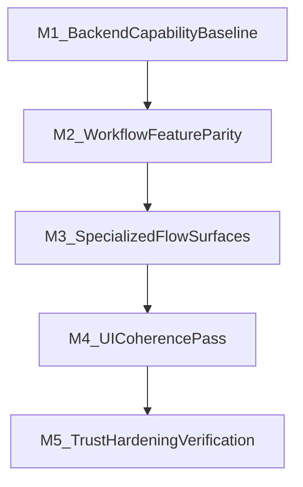

# Best-of-3 Consolidation Timeline Update

## Scope Kept Intact

- Keep Supabase auth + Supabase-backed RAG as in-scope.
- Keep feature-first priority (RAG CAEN/business capabilities before visual polish).
- Keep PFA feature depth from `civic-agent-buian` as canonical, then re-skin for coherence.
- Keep `HANDOFF.md` priorities as reference baseline.

## Updated Delivery Cadence (Milestone-Driven)

### Milestone M1 — Backend Capability Baseline (Fast Track)

**Goal:** unblock retrieval-driven intelligence and auth plumbing early.

**Workstream**

- Supabase integration layer and env contract hardening.
- RAG retrieval path for CAEN and explain/help actions.
- Deterministic local fallback behavior when RAG is unavailable.
- Supabase OTP/session groundwork replacing mock-only assumptions.

**Exit criteria**

- RAG CAEN path returns source-backed suggestions when Supabase is available.
- Chat/step actions still function with local fallback when Supabase is down/missing.
- Login/verify flow supports Supabase OTP without breaking demo fallback.

**Primary files**

- [`/Users/buiandragos/Documents/faculta/Cluj-Hackathon/civic-agent-hackathon/src/services/rag.ts`](/Users/buiandragos/Documents/faculta/Cluj-Hackathon/civic-agent-hackathon/src/services/rag.ts)
- [`/Users/buiandragos/Documents/faculta/Cluj-Hackathon/civic-agent-hackathon/src/services/supabaseAuth.ts`](/Users/buiandragos/Documents/faculta/Cluj-Hackathon/civic-agent-hackathon/src/services/supabaseAuth.ts)
- [`/Users/buiandragos/Documents/faculta/Cluj-Hackathon/civic-agent-hackathon/src/services/supabaseClient.ts`](/Users/buiandragos/Documents/faculta/Cluj-Hackathon/civic-agent-hackathon/src/services/supabaseClient.ts)
- [`/Users/buiandragos/Documents/faculta/Cluj-Hackathon/civic-agent-hackathon/src/components/civis-chat.tsx`](/Users/buiandragos/Documents/faculta/Cluj-Hackathon/civic-agent-hackathon/src/components/civis-chat.tsx)
- [`/Users/buiandragos/Documents/faculta/Cluj-Hackathon/civic-agent-hackathon/src/routes/login.tsx`](/Users/buiandragos/Documents/faculta/Cluj-Hackathon/civic-agent-hackathon/src/routes/login.tsx)
- [`/Users/buiandragos/Documents/faculta/Cluj-Hackathon/civic-agent-hackathon/src/routes/verify.tsx`](/Users/buiandragos/Documents/faculta/Cluj-Hackathon/civic-agent-hackathon/src/routes/verify.tsx)

### Milestone M2 — Workflow Feature Parity

**Goal:** make core procedures materially richer and action-complete.

**Workstream**

- Port V2 `info[]` + `actions[]` density into priority flows.
- Ensure mode metadata (`online`/`in_person`/`hybrid`) coverage.
- Add/merge `vanzare-auto` strategy for parity with V2 guidance depth.

**Exit criteria**

- Priority workflows show rich, actionable content, not plain cards.
- CAEN/explain actions are retrieval-first with fallback.

**Primary files**

- [`/Users/buiandragos/Documents/faculta/Cluj-Hackathon/civic-agent-hackathon/src/services/govApiMock.ts`](/Users/buiandragos/Documents/faculta/Cluj-Hackathon/civic-agent-hackathon/src/services/govApiMock.ts)
- [`/Users/buiandragos/Documents/faculta/Cluj-Hackathon/civic-agent-hackathon/src/components/workflow/step-action-button.tsx`](/Users/buiandragos/Documents/faculta/Cluj-Hackathon/civic-agent-hackathon/src/components/workflow/step-action-button.tsx)

### Milestone M3 — Specialized Flow Surfaces (PFA + Antecontract)

**Goal:** deliver the highest-value guided experiences.

**Workstream**

- Dedicated PFA wizard route with V2 functional depth.
- Dedicated antecontract form + preview flow wired to existing PDF services.
- Tight integration with task progress and chat action shortcuts.

**Exit criteria**

- PFA wizard matches/exceeds V2 functional coverage.
- Antecontract route supports prefill, edit, preview, export.

**Primary files**

- [`/Users/buiandragos/Documents/faculta/Cluj-Hackathon/civic-agent-hackathon/src/routes/workflow.$id.tsx`](/Users/buiandragos/Documents/faculta/Cluj-Hackathon/civic-agent-hackathon/src/routes/workflow.$id.tsx)
- [`/Users/buiandragos/Documents/faculta/Cluj-Hackathon/civic-agent-hackathon/src/services/pdf/declaratiePfa.ts`](/Users/buiandragos/Documents/faculta/Cluj-Hackathon/civic-agent-hackathon/src/services/pdf/declaratiePfa.ts)
- [`/Users/buiandragos/Documents/faculta/Cluj-Hackathon/civic-agent-hackathon/src/services/pdf/antecontract.ts`](/Users/buiandragos/Documents/faculta/Cluj-Hackathon/civic-agent-hackathon/src/services/pdf/antecontract.ts)

### Milestone M4 — UI Coherence Pass

**Goal:** lift consistency and hierarchy without reducing feature richness.

**Workstream**

- Workflow step UI density upgrade (mode chips, metadata row, accordion consistency).
- Dashboard and vault structural polish (status visibility, fallback visibility).
- Alexia-inspired hierarchy improvements only where they improve clarity.

**Exit criteria**

- UI coherence improved across home/workflow/vault.
- RAG availability/degraded mode is visible and understandable.

**Primary files**

- [`/Users/buiandragos/Documents/faculta/Cluj-Hackathon/civic-agent-hackathon/src/routes/index.tsx`](/Users/buiandragos/Documents/faculta/Cluj-Hackathon/civic-agent-hackathon/src/routes/index.tsx)
- [`/Users/buiandragos/Documents/faculta/Cluj-Hackathon/civic-agent-hackathon/src/routes/vault.tsx`](/Users/buiandragos/Documents/faculta/Cluj-Hackathon/civic-agent-hackathon/src/routes/vault.tsx)
- [`/Users/buiandragos/Documents/faculta/Cluj-Hackathon/civic-agent-hackathon/src/routes/workflow.$id.tsx`](/Users/buiandragos/Documents/faculta/Cluj-Hackathon/civic-agent-hackathon/src/routes/workflow.$id.tsx)

### Milestone M5 — Trust, Hardening, Verification

**Goal:** stabilize for demos/review and reduce integration risk.

**Workstream**

- Improve scan/vault rejection and quality explainability.
- Validate privacy boundaries for RAG/chat paths.
- Full QA pass for auth, RAG, fallback, tasks, specialized flows.

**Exit criteria**

- No critical regressions in auth/workflows/chat/vault.
- Fallback paths verified end-to-end.
- Known risks tracked with explicit follow-ups.

## Timeline View

## Milestone Gate Rules

- Do not start M3 before M1+M2 exit criteria are met.
- Do not start final polish (M4) before PFA/antecontract functional parity (M3) is in place.
- M5 is required before calling the merge “complete” regardless of UI polish status.
