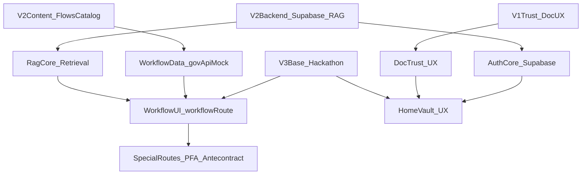

# Best-of-3 Consolidation Plan

## Target And Constraints

- Implement only in [`/Users/buiandragos/Documents/faculta/Cluj-Hackathon/civic-agent-hackathon`](/Users/buiandragos/Documents/faculta/Cluj-Hackathon/civic-agent-hackathon).
- Treat [`/Users/buiandragos/Documents/faculta/Cluj-Hackathon/civic-agent-hackathon/HANDOFF.md`](/Users/buiandragos/Documents/faculta/Cluj-Hackathon/civic-agent-hackathon/HANDOFF.md) as source of truth for merge status and priorities.
- Keep V3 foundations (TanStack routes, accessibility shell, workflow route structure) and layer in V2 backend strengths where beneficial.
- Supabase auth and Supabase-backed RAG are explicitly allowed and in-scope.
- Preserve privacy guardrails: no raw document files or full CNP sent to LLM endpoints; sensitive document handling remains strictly controlled with explicit consent and redaction.
- Delivery priority is feature completeness and reliability first; UX/visual polish follows once core capabilities are fully integrated.

## Best Implementation Selection (By Feature)

- **App shell + accessibility + mobile coherence:** keep V3 implementation in [`src/components/app-shell.tsx`](/Users/buiandragos/Documents/faculta/Cluj-Hackathon/civic-agent-hackathon/src/components/app-shell.tsx), [`src/styles.css`](/Users/buiandragos/Documents/faculta/Cluj-Hackathon/civic-agent-hackathon/src/styles.css), [`src/components/accessibility-menu.tsx`](/Users/buiandragos/Documents/faculta/Cluj-Hackathon/civic-agent-hackathon/src/components/accessibility-menu.tsx).
- **Workflow data richness + action semantics:** use V2 as canonical content source from [`civic-agent-buian/Civic Guide AI/src/lib/flows-catalog.ts`](/Users/buiandragos/Documents/faculta/Cluj-Hackathon/civic-agent-buian/Civic%20Guide%20AI/src/lib/flows-catalog.ts), normalized into [`src/services/govApiMock.ts`](/Users/buiandragos/Documents/faculta/Cluj-Hackathon/civic-agent-hackathon/src/services/govApiMock.ts).
- **Auth/session model:** adopt Supabase auth patterns from V2 and replace mock login/OTP in target routes/stores.
- **RAG and knowledge retrieval:** keep V2 RAG/Supabase retrieval approach as the default for explain/help actions and CAEN/business guidance, with deterministic fallback to local workflow info when retrieval is unavailable.
- **Workflow presentation and interactivity:** base on current V3 route [`src/routes/workflow.$id.tsx`](/Users/buiandragos/Documents/faculta/Cluj-Hackathon/civic-agent-hackathon/src/routes/workflow.$id.tsx), upgraded with V2 mode chips/metadata density.
- **PFA and antecontract specialized UX:** port V2 sub-flow UX patterns from [`flows.$flowId.pfa.tsx`](/Users/buiandragos/Documents/faculta/Cluj-Hackathon/civic-agent-buian/Civic%20Guide%20AI/src/routes/_authenticated/flows.$flowId.pfa.tsx) and [`flows.$flowId.antecontract.tsx`](/Users/buiandragos/Documents/faculta/Cluj-Hackathon/civic-agent-buian/Civic%20Guide%20AI/src/routes/_authenticated/flows.$flowId.antecontract.tsx) into hackathon routes, wired to existing client PDF services.
- **PFA flow depth priority:** treat V2 PFA journey as the canonical feature baseline (CAEN guidance, declarations, helper actions, next-step logic), then adapt presentation to the more coherent visual system in the target app.
- **Document trust UX:** extend existing V1-ported pipeline in [`src/services/docIntelligence/`](/Users/buiandragos/Documents/faculta/Cluj-Hackathon/civic-agent-hackathon/src/services/docIntelligence) with better rejection/quality surfacing inspired by Alexia dashboard upload patterns.
- **Visual coherence goal (alexia-inspired):** adopt layout hierarchy and status-card density from alexia dashboard components while keeping current token system and a11y stack.

## Execution Phases

### Phase 1 — Supabase + RAG Foundation

- Integrate Supabase client/server wiring and required environment contracts into `civic-agent-hackathon`.
- Bring over essential V2 schema concepts for auth/profile/chat/retrieval paths and adapt to target routing architecture.
- Re-enable retrieval-backed `explain` actions (RAG) with strict prompt-level and payload-level privacy filters.
- Keep local static resolver (`govApiMock.resolveQuery`) as an explicit fallback path when RAG is unavailable.

### Phase 2 — Feature Core: RAG-First Assistant Capabilities

- Implement RAG-backed CAEN and business-flow intelligence as the default behavior for PFA-related actions.
- Route step actions (`caen_suggest`, explain/help actions, related assistant helpers) through retrieval-backed tools where possible.
- Define reliable fallback behavior (local CAEN dataset + static guidance) for degraded/offline scenarios.
- Validate retrieval grounding quality and source confidence before UX polish work begins.

### Phase 3 — Auth Unification

- Replace mock login/OTP with Supabase auth flows, route guards, and persistent session handling.
- Migrate profile bootstrap and onboarding expectations to align with Supabase user records while keeping vault UX continuity.
- Ensure backward-safe migration for existing local demo state (graceful fallback and/or one-time migration logic).

### Phase 4 — Complete Workflow Content Parity (Highest Leverage)

- Expand enriched `info[]` + `actions[]` coverage across priority workflows in [`src/services/govApiMock.ts`](/Users/buiandragos/Documents/faculta/Cluj-Hackathon/civic-agent-hackathon/src/services/govApiMock.ts):
  - `car-registration-2nd-hand`
  - `passport-issuance`
  - `renew-driver-license`
  - `anaf-declaration`
  - add/merge V2 `vanzare-auto` content strategy (new workflow id or mapped enhancement).
- Add step-level `mode` metadata (`online` / `in_person` / `hybrid`) where absent and keep existing fee/location/time fields aligned.

### Phase 5 — Workflow UI Upgrade (Visible “Best-of-3” Shift)

- Upgrade [`src/routes/workflow.$id.tsx`](/Users/buiandragos/Documents/faculta/Cluj-Hackathon/civic-agent-hackathon/src/routes/workflow.$id.tsx):
  - render mode chips and compact “Unde / Cost / Durată” row on every step,
  - keep accordions/actions but make density consistent for all workflows,
  - apply subtle motion transitions (existing CSS and optional framer-motion where it adds value).
- Ensure action affordances remain identical for deep links/maps/CAEN/PDF/chat explain paths via [`src/components/workflow/step-action-button.tsx`](/Users/buiandragos/Documents/faculta/Cluj-Hackathon/civic-agent-hackathon/src/components/workflow/step-action-button.tsx).

### Phase 6 — Port Specialized V2 Flows Into Hackathon Routes

- Add a dedicated PFA wizard route (under workflow scope) that reuses current local vault and PDF generator in [`src/services/pdf/declaratiePfa.ts`](/Users/buiandragos/Documents/faculta/Cluj-Hackathon/civic-agent-hackathon/src/services/pdf/declaratiePfa.ts).
- Port all high-value functional affordances from V2 PFA flow first (most detailed reference), including CAEN assist context, copy helpers, guided checklist states, and declaration support.
- Rework visual structure of that PFA route to align with target coherent style (clean hierarchy, improved spacing/typography, consistent cards/badges), rather than replicating V2 styling directly.
- Add antecontract form+preview route that drives [`src/services/pdf/antecontract.ts`](/Users/buiandragos/Documents/faculta/Cluj-Hackathon/civic-agent-hackathon/src/services/pdf/antecontract.ts).
- Link these specialized screens from relevant workflow steps and task context.

### Phase 7 — Home/Vault UX Coherence Pass (alexia-inspired density)

- Upgrade dashboard composition in [`src/routes/index.tsx`](/Users/buiandragos/Documents/faculta/Cluj-Hackathon/civic-agent-hackathon/src/routes/index.tsx):
  - stronger at-a-glance cards (active tasks, vault docs, profile completeness),
  - clearer start-flow grid,
  - explicit status banner for AI/RAG availability and fallback mode.
- Improve vault layout in [`src/routes/vault.tsx`](/Users/buiandragos/Documents/faculta/Cluj-Hackathon/civic-agent-hackathon/src/routes/vault.tsx) with sectioned structure and stronger quality/error surfacing for uploads.

### Phase 8 — Trust And Quality Polish

- Surface document quality and type mismatch feedback more prominently (not only toasts) using existing `docIntelligence` outputs in:
  - [`src/components/vault-upload-card.tsx`](/Users/buiandragos/Documents/faculta/Cluj-Hackathon/civic-agent-hackathon/src/components/vault-upload-card.tsx)
  - [`src/routes/scan.tsx`](/Users/buiandragos/Documents/faculta/Cluj-Hackathon/civic-agent-hackathon/src/routes/scan.tsx)
- Keep i18n-ready structure in mind by routing new copy through translation helpers where practical.
- Validate RAG safety boundaries (redaction, no document-byte leakage, explicit source citation in responses).

## Merge Boundary (What We Explicitly Do Not Port)

- Do not port V1 FastAPI/Next app wholesale; only portable document-intelligence logic and UX patterns.
- Do not remove existing accessibility and mobile-first shell behaviors from V3 while integrating Supabase/RAG capabilities.
- Do not send full document binaries or unredacted sensitive identifiers to generative model calls.

## Validation Checklist

- Typecheck/lint/build pass in target repo.
- Manual QA on key flows:
  - Supabase auth login/logout/session restore works across reloads,
  - RAG explain actions return grounded answers and degrade gracefully to static guidance,
  - CAEN suggestions use RAG-backed retrieval by default with clear source-grounded responses,
  - CAEN/business actions have deterministic local fallback when retrieval is unavailable,
  - PFA wizard functionally matches or exceeds V2 depth (step coverage, helper actions, CAEN/declaration support),
  - PFA screen visually aligns with target coherent UI style rather than raw V2 styling,
  - enriched workflows show mode chips + info/actions,
  - PFA and antecontract specialized screens reachable and functional,
  - vault/scan quality feedback visible and understandable,
  - chat + fallback both work when RAG or model provider is unavailable,
  - task progress remains synced with workflow updates.

## Implementation Map Diagram

